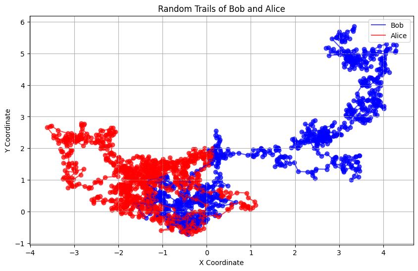
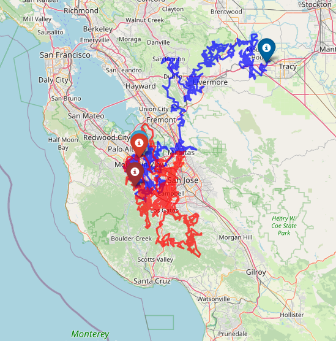

# Contact Tracing Simulation on World Map

This project simulates contact tracing by generating and plotting random trails of coordinates for 2 individuals (Bob and Alice) on a world map. The trails are visualized using `folium` and the coordinates are geocoded using `geopy`.

## Features
- Geocodes a list of addresses to obtain latitude and longitude.
- Generates random coordinate trails for 2 individuals near the first address.

- Plots the trails on a world map using `folium`, with distinct colors for each individual.
- Displays the initial and final points for both individuals.
- Calculates and prints the distance between the first 2 addresses.

